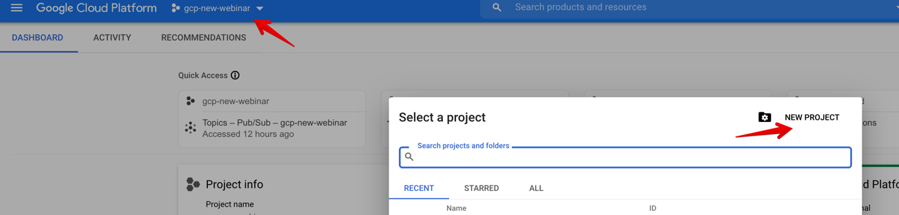
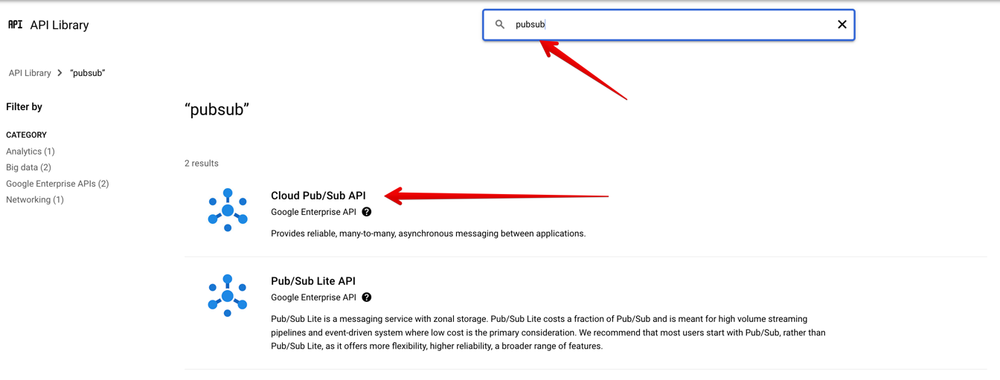
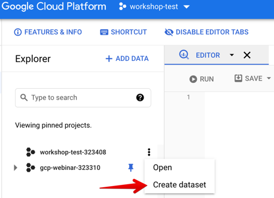
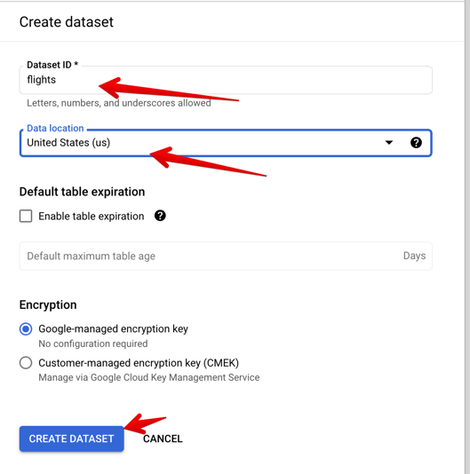
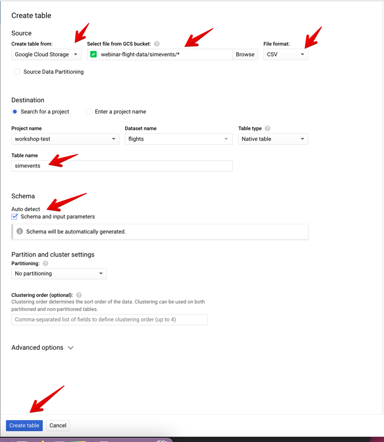
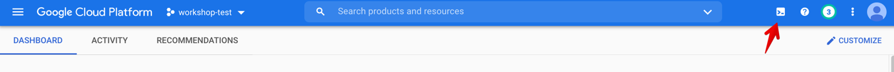
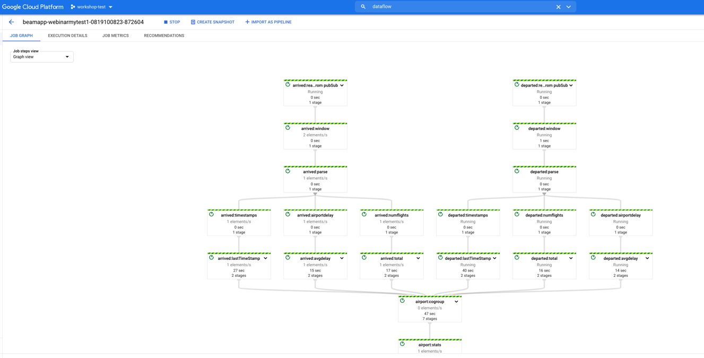
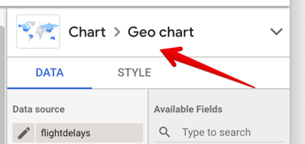
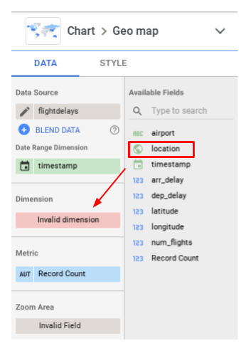
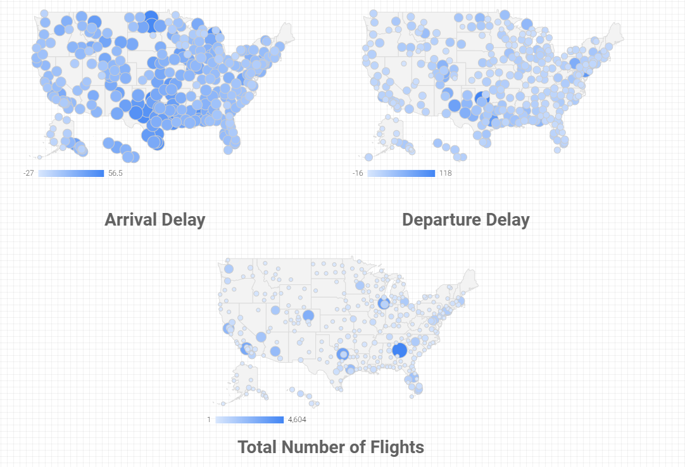

# GCP Workshop

## Processing and visualizing streaming data with GCP

This workshop is based on the qwiklabs [practice lab](https://www.qwiklabs.com/focuses/4188?catalog_rank=%7B%22rank%22%3A6%2C%22num_filters%22%3A2%2C%22has_search%22%3Atrue%7D&parent=catalog&search_id=10964559).   
You are encouraged to go and explore both this lab, and a lot of others on the platform.   

### Prerequisites
* GCP account with the linked credit card   

### Overview
We will be building a small project for the streaming data visualization. All of the components of the project will be based on GCP services plus a bit of Python code. In the scope of this exercise we'll touch the following services:   
* GCS (Google Cloud Storage)
* BigQuery (Scalable analytical platform)
* PubSub (distributed message broker)
* DataFlow (framework for distributed batch/streaming processing)
* DataStudio (service for building visual reports)   
   
We will first load existing data into the BigQuery table. It then will be used to generate events and simulate the actual streaming source. Next, we will submit pre-defined Dataflow pipeline to process the incoming events. The processed data will be stored first back to the PubSub and then to BigQuery. After that we will create BigQuery view which will be accessing the necessary data. The created view will be used by DataStudio as a source of data for visualisation.   

### Preparing the Project
As a first step you should create the project where all our activities will take place. You can use GCP services only in the scope of the projects. To create a new project go to:   
   
Add the name and click "Create". You can leave the rest of the properties with default values.   
You also need to make sure that the billing account is linked to the new project.

In order to use some services we need to enable the proper APIs. To do that go to **HOME>APIs & Services>Library** and search for PubSub

Click on Cloud Pub/Sub API and in the next window choose "ENABLE". It may take a minute or two to enable the API.   
   
Do the same for enabling DataFlow API.   

### Loading data

For this exercise we will be using the existing data set with the US flights information. I prepared the dataset as CSV files in the GCS. We need to import it to BigQuery.   
Go to **HOME>BigQuery**. It is under BIG DATA section.  
   
First we need to create dataset ``flights``  

   
It is similar to database space in RDBMS.
  


Open the dataset and create the table ``simevents``. You should use the existing data from this bucket to create the table:  
``webinar-flight-data/simevents/*``   
   
It may take around a minute to create the table and load the data.  

### Activate Cloud Shell
Cloud Shell is a virtual machine that is loaded with development tools. It offers a persistent 5GB home directory and runs on the Google Cloud. Cloud Shell provides command-line access to your Google Cloud resources.

In the Cloud Console, in the top right toolbar, click the Activate Cloud Shell button   


### Clone the Data Science on Google Cloud Platform Repository
This lab uses the sample code for Chapter 4 from the Data Science on Google Cloud Platform book from O'Reilly.  

In Cloud Shell enter the following commands to clone the repository:  

```
git clone https://github.com/GoogleCloudPlatform/data-science-on-gcp/
```  

Change to the repository source directory for this lab:

```
cd ~/data-science-on-gcp/04_streaming/simulate
```  
Execute the following command to download and update the packages list.  

```
sudo apt-get update
```  

Python virtual environments are used to isolate package installation from the system.  

``` 
sudo apt-get install virtualenv
```  
If prompted [Y/n], press Y and then Enter.  

```
virtualenv -p python3 venv
```  

Activate the virtual environment.  

```
source venv/bin/activate
```  

Install the Google Cloud Python components required by the Python script that will simulate real time flight events:  

```
pip install --upgrade google-cloud-pubsub  
pip install google-cloud-bigquery
pip install --upgrade timezonefinder pytz 'apache-beam[gcp]'
```  

### Create the Real-Time Google Dataflow Stream Processing Job
Create a default OAuth application credential that allows the Python real-time event simulation script to access the simulated event data in BigQuery:  

```
gcloud auth application-default login
```  

When prompted to continue enter Y.

Click on the authentication link that appears in the output to open the Google API authentication page.  

Select the credentials you signed into the lab with, then click ALLOW.  

Copy the authentication code that is displayed and paste it into the Enter verification code prompt, then press Enter. You should see a confirmation that the credentials will now be used by any application requesting Application Default Credentials.  

Assign your project ID to an environment variable.  

```
export PROJECT_ID=$(gcloud info --format='value(config.project)')
```  

Now, run this simulation script to create the Google Pub/Sub topics:  

```
python ./simulate.py --project $PROJECT_ID --startTime '2015-01-01 06:00:00 UTC' --endTime '2015-01-04 00:00:00 UTC' --speedFactor=100
```  

### Deploy the Google Dataflow job to process stream data  
Open a new cloud console window.  
Download the repository with Dataflow job:  
```
git clone https://github.com/Dmytro-Pryimak/gcp-workshop.git  
cd gcp-workshop
```

Do the same steps as in the previous part: 

Python virtual environments are used to isolate package installation from the system.  

```
sudo apt-get install virtualenv
```  
If prompted [Y/n], press Y and then Enter.  

```
virtualenv -p python3 venv
```  

Activate the virtual environment.  

```
source venv/bin/activate
```  

Install the Google Cloud Python components required by the Python script that will simulate real time flight events:  

```
pip install --upgrade google-cloud-pubsub  
pip install google-cloud-bigquery
pip install --upgrade timezonefinder pytz 'apache-beam[gcp]'
```  

### Create the Real-Time Google Dataflow Stream Processing Job
Create a default OAuth application credential that allows the Python real-time event simulation script to access the simulated event data in BigQuery:  

```
gcloud auth application-default login
```  

When prompted to continue enter Y.

Click on the authentication link that appears in the output to open the Google API authentication page.  

Select the credentials you signed into the lab with, then click ALLOW.  

Copy the authentication code that is displayed and paste it into the Enter verification code prompt, then press Enter. You should see a confirmation that the credentials will now be used by any application requesting Application Default Credentials.  

Assign your project ID to an environment variable.  

```
export PROJECT_ID=$(gcloud info --format='value(config.project)')
```  

Create Bucket to hold the dataflow data:  

```
export BUCKET=$PROJECT_ID-stream
```  
```
gsutil mb gs://$BUCKET
```

Run the script to submit Dataflow application:  
```
python -m average_delay_pipeline --runner=dataflow --project=$PROJECT_ID --region=us-central1 --streaming --temp_location=gs://$PROJECT_ID-stream/temp/ --staging_location=gs://$PROJECT_ID-stream/staging --averagingInterval=15 --pipeline_project=$PROJECT_ID --speedupFactor=100
```  

Wait for the job to start and check it in the Dataflow UI:  
  

It may take around 10-12 minutes before the data appear in BigQuery. You can play with the input parameters to speed-up the process.

### Checking data in BigQuery  

Go to BigQuery and check if the table ``streaming_delays`` was created. It may take some time for DataFlow to write the data into the table. You can run the following query for check:  
```
SELECT
  *
FROM
  flights.streaming_delays
WHERE
  airport = 'DEN'
ORDER BY
  timestamp
```   
After the table was created you need to create a view which will be the data source for DataStudio dashboard.  

You can now build on this to provide a query that will report aggregate arrival and delay times for all airports.  
```
#standardSQL
SELECT
  airport,
  last[safe_OFFSET(0)].*,
  CONCAT(CAST(last[safe_OFFSET(0)].latitude AS STRING), ",",
        CAST(last[safe_OFFSET(0)].longitude AS STRING)) AS location
FROM (
  SELECT
    airport,
    ARRAY_AGG(STRUCT(arr_delay,
        dep_delay,
        timestamp,
        latitude,
        longitude,
        num_flights)
    ORDER BY
      timestamp DESC
    LIMIT
      1) last
  FROM
    `[PROJECT_ID].flights.streaming_delays`
  GROUP BY
    airport )
```  

This query enhances the aggregate delay information that the previous query provided and retains the latest update from each airport, thus maintaining visibility to airports with very low flight numbers. The query also provides a combined latitude and longitude value that is in a format that aligns with one of the geographic location formats recognized by Data Studio.

The query has to be in this format as you will be converting this into a BigQuery database view. You want to save this as a view so that you can work with it in Google Data Studio.  

Copy the updated query from your local text file into the query box.  

Click RUN.  

Click Save view.  

In the Table Name field, enter flightdelays.  

Click Save to save the new view.

### Visualize your data in Data Studio  

Click this link to open Google Data Studio - https://datastudio.google.com/  

Click the blue + or Blank Report.  

Click GET STARTED.  

Select the acknowledgment to accept the terms of service and click ACCEPT.  

Click "No, thanks" for all of the notification email options and then click DONE.  

Add new BigQuery connector and the newly created view as a data source.  

The table will appear on the canvas but you need to change the type to Geo chart.  
  

The map component rectangle will be added to the canvas.

In the Available Fields menu, on the right, drag location to the Dimension block, replacing Invalid dimension.

  

On the right side, in the Zoom Area block, select United States.  

In the Metric block click Record Count and select arr_delay.  

Size the rectangle below the chart to add a label to the map. Type in Arrival Delay to identify this as the chart that displays the arrival delay results.  

Select the map and label, and copy and paste it onto the canvas.  

Click on the new map and switch back to the Data tab in the right menu. Change the metric to dep_delay. Change the label for this chart to Departure Delay.  

Make a third copy of the map and label. Change the metric to num_flights. Change the label for this chart to Total Number of Flights.  
  

That's it! You connected few powerful GCP services to build simple streaming processing up. Feel free to play with the code and configurations of the Dashboards and applications.